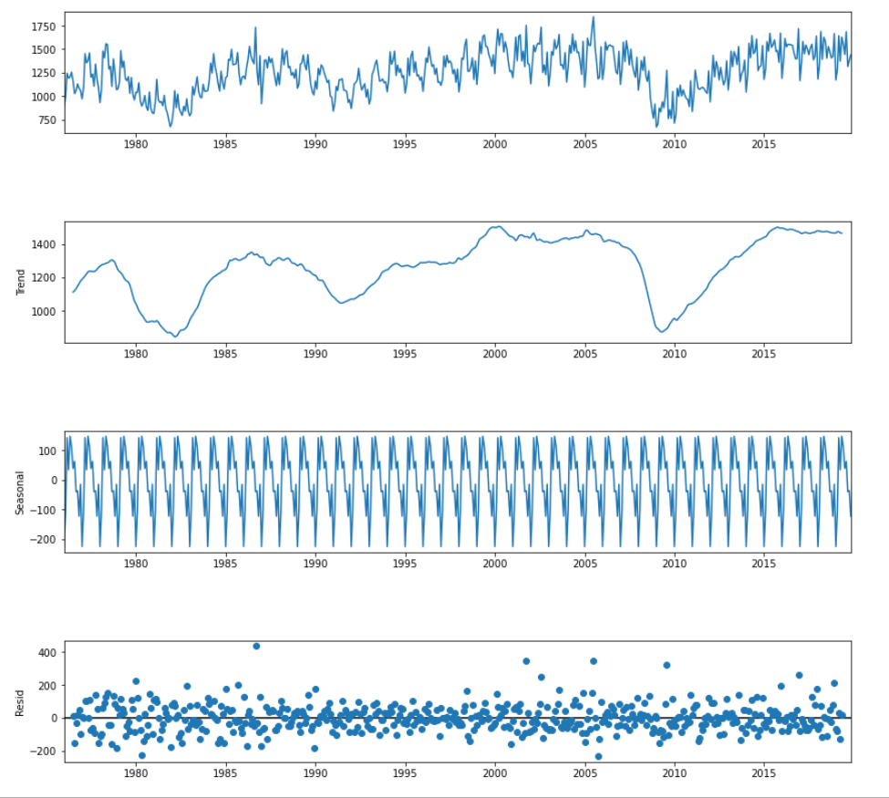
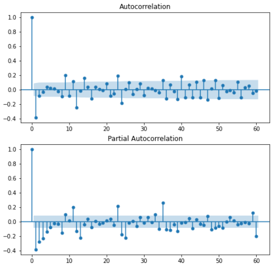
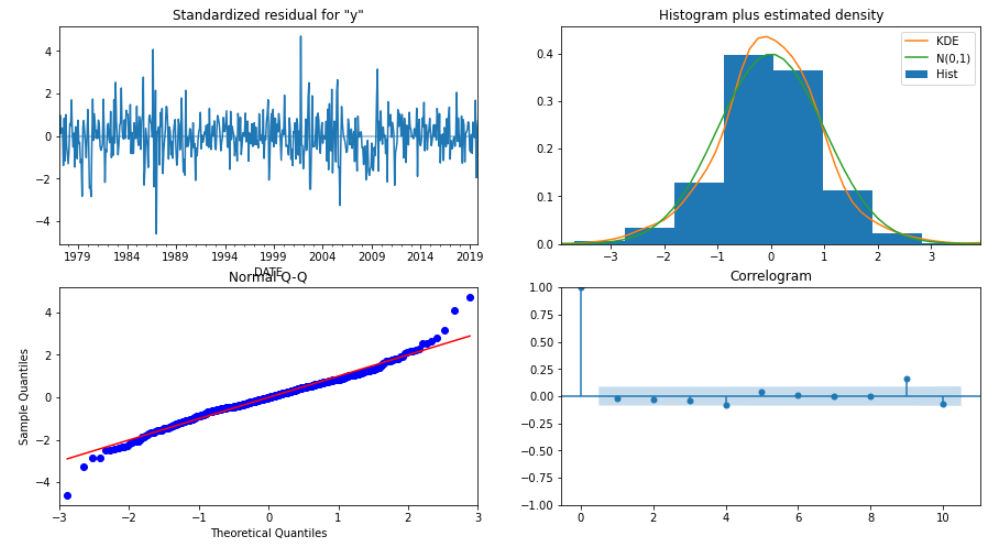
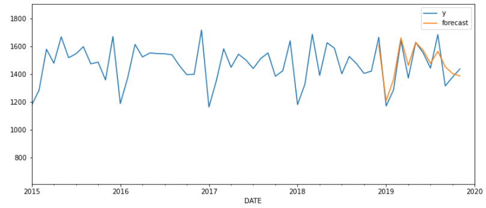

# Forecast Monthly Vehicle Sales in the United States

## Introduction
This project is about time series forecasting. The Federal Reserve Bank of St. Louis publishes total vehicle sales in the United States. Data of monthly total vehicle sales (all units in thousand) between January 1976 and November 2019 were downloaded.

The link to download the data:
**[Total Vehicle Sales in the United States](https://fred.stlouisfed.org/series/TOTALNSA.)**

## Installation
The code was developed using the Anaconda distribution of Python, versions 3.8.1. Python libraries used are `numpy`, `pandas`, `scipy`, `statsmodels`, `matplotlib`, `seaborn`, `sklearn`

## Analysis
There are no missing data. There is a total of 527 monthly records. The average sales is 1261.7 with an SD of 225.6. To find the trend, the time series data were decomposed to trend, seasonality and error. The plot below shows the trend after taking out seasonality and errors. In general, the number of vehicle sales is trending upward with periodical drops. The three big drops coincide with economic recessions.

  

The Dickey‐Fuller test suggests that the data are stationary after a seasonal difference and another regular difference. Guided by the ACF and PACF graphs, I began with an ARIMA(4,1,1)(1,1,1)12 model, indicating a first difference and a seasonal difference, nonseasonal MA(1) component and seasonal MA(1) component, and non‐seasonal AR(4) component and seasonal AR(1) component.

  

Diagnostic plots show the residues seem to be normally distributed.

  

To validate the model, the mean absolute percentage error (MAPE) was calculated using the developed model for the period of December 2018 through November 2019. The MAPE is 3.8%, suggesting that the model is good.

  

## Forecast and Conclusion:
The predicted total vehicle sales in December 2019 is 1625.8, with 90% confidence interval: [1476.6, 1774.9].
The predicted total vehicle sales in May 2020 is 1619.8, with 90% confidence interval: [1423.8, 1815.7].

## Caution:
Major events, such as economic recession will throw off the forecast.
The market share of ACME might change due to competition.
